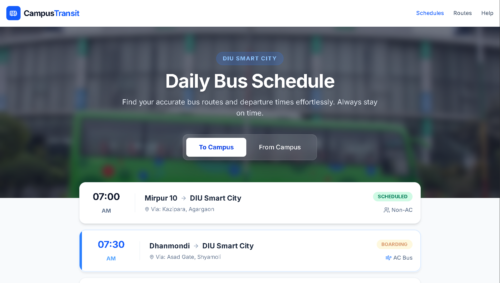

<div align="center">

  

  <br />
  <p><strong>A modern, responsive frontend application for tracking daily university bus schedules.</strong></p>

  <p>
    
    
    
  </p>

</div>

---

## 🚀 Live Demo

🔥 **Check out the live project here:** 🔗 **[CampusTransit Live App](https://atul-dev-ai.github.io/campus-transport/)** 

 

---

## ✨ Key Features

- **Interactive Tab Switching:** Seamlessly toggle between "To Campus" and "From Campus" bus schedules using Vanilla JavaScript.
- **Real-Time Status Indicators:** Visual badges showing bus statuses like `Scheduled`, `Boarding`, `Waiting`, and `Upcoming`.
- **Modern UI/UX:** Designed with a "Mobile-First" approach using Tailwind CSS, featuring glassmorphism, hover effects, and a premium dark footer.
- **Responsive Layout:** Perfectly scales across mobile phones, tablets, and desktop monitors.
- **Developer Portfolio Integration:** Includes a visually striking developer bio section at the footer.

---

## 🛠️ Tech Stack

- **Markup:** HTML5
- **Styling:** Tailwind CSS (via CLI/CDN)
- **Icons:** Lucide Icons
- **Scripting:** Vanilla JavaScript (DOM Manipulation)

---

## 💻 Run Locally on Your Machine

Follow these steps to run and edit this project on your local computer:

**1. Clone the repository:**
    ```bash
    git clone [https://github.com/atul-dev-ai/bus_schedule.git](https://github.com/atul-dev-ai/bus_schedule.git)
    ```
    ```bash
    cd bus_schedule
    ```

## 2. Open the Project:
Simply double-click the index.html file to open it in your browser, or use VS Code's "Live Server" extension for hot-reloading.

## 3. Run Tailwind Watcher (For Development):
If you are modifying the Tailwind utility classes and have package.json configured:

  ```bash
  npm install
  ```
  ```bash
  npm run watch
  ```

---

## 👨‍💻 About the Developer
Developed with ❤️ by Atul Paul.

I am a software developer and student at Daffodil International University (DIU), passionate about Web Development, Generative AI, and Deep Learning.

📫 Connect with me:

GitHub: @atul-dev-ai

LinkedIn: Paul Atul

<p align="center">
<i>If this project helped you, please consider giving it a ⭐ on GitHub!</i>
</p>
